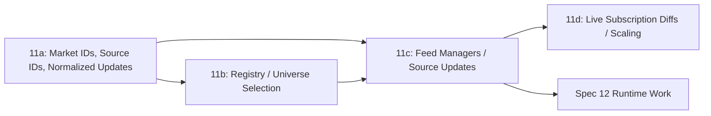

# Spec 11: Market Universe and Feed Plane (Overview)

## Priority: MUST HAVE

This umbrella spec replaces the old monolithic work order for market discovery and feed handling.

It is intentionally split because the original version bundled:

- shared identity and event types
- HTTP registry/discovery work
- feed ownership
- live subscription diffing and connection scaling

Those are related, but they are not one implementation step.

This workstream also needs to support two different strategy shapes from one modular foundation:

- single-feed strategies, such as rewards or simple threshold strategies
- cross-feed strategies, such as latency-sensitive Polymarket-vs-reference-price triggers

That means the foundation cannot assume every update comes from one Polymarket public feed, and it cannot assume every strategy depends on a discoverable market universe.

## Split Specs

Run these in order unless a later spec explicitly says it can start earlier:

1. [specs/11a-market-foundation-and-normalized-events.md](/Users/sam/Desktop/Projects/rtt/specs/11a-market-foundation-and-normalized-events.md)
   Why first: it defines the shared market IDs, source IDs, normalized update shapes, and config migration seam that everything else needs.
2. [specs/11b-market-registry-and-universe-selection.md](/Users/sam/Desktop/Projects/rtt/specs/11b-market-registry-and-universe-selection.md)
   Why second: it creates the control plane that discovers markets and chooses the active universe off the hot path where discovery is relevant.
3. [specs/11c-feed-manager-and-normalized-public-updates.md](/Users/sam/Desktop/Projects/rtt/specs/11c-feed-manager-and-normalized-public-updates.md)
   Why third: it makes feed ownership explicit per source instance and preserves rich normalized updates end to end.
4. [specs/11d-dynamic-subscription-diffs-and-feed-scaling.md](/Users/sam/Desktop/Projects/rtt/specs/11d-dynamic-subscription-diffs-and-feed-scaling.md)
   Why fourth: diffing, batching, pacing, and sharding are real connection-manager work and should be isolated behind verified WebSocket semantics.

## Dependency Notes

- `11a` is the true foundation spec. It must land before any hot-state or runtime work in Spec 12.
- `11b` and `11c` are separable. The registry can exist before live subscription changes are supported.
- `11b` is specifically about discovery-selected market universes where discovery makes sense. Explicit external reference feeds do not depend on it.
- `11d` is explicitly not required to get value from the first multi-market architecture pass.

## Reference Sweep

The following references should be treated as required inputs where applicable:

- Official Polymarket docs are the source of truth for Gamma vs CLOB boundaries, rate limits, public market-data endpoints, and WebSocket message/subscribe semantics:
  - https://docs.polymarket.com/api-reference/introduction
  - https://docs.polymarket.com/market-data/overview
  - https://docs.polymarket.com/market-data/websocket/overview
  - https://docs.polymarket.com/api-reference/wss/market
- `floor-licker/polyfill-rs` is the primary performance-oriented code reference for Spec `11c` and especially `11d` when evaluating low-allocation WS parsing, reconnect handling, and subscription-diff execution patterns:
  - Carry forward concrete ideas from that repo where they fit: zero-allocation post-warmup message loops, SIMD-accelerated JSON parsing, fixed-point conversion at ingress boundaries, bounded book depth, pre-allocated/buffer-pooled hot paths, and explicit reconnect/backoff handling.
  - https://github.com/floor-licker/polyfill-rs
- `Polymarket/rs-clob-client` is the baseline official Rust SDK reference for market/token models, Gamma fetching, and WebSocket subscription behavior across `11a`–`11d`:
  - https://github.com/Polymarket/rs-clob-client
- Gamma is the canonical live registry source for `11b`, including pagination and reward/tick-size metadata:
  - https://gamma-api.polymarket.com/markets
- PMXT archive data and loader tooling are the preferred historical/offline references for `11b` snapshot import/export and replay-oriented registry work:
  - https://archive.pmxt.dev/Polymarket
  - https://github.com/pmxt-dev/pmxt
- Supporting open-source bots may inform selection and universe-scanning patterns, but they are illustrative only and must not override official docs or SDK behavior:
  - https://github.com/singhparshant/Polymarket
  - https://github.com/bitman09/Rust-Politics-Sports-Polymarket-Trading-Bot

## Done When

This umbrella spec is complete when:

- the system has shared market identity, feed-source identity, and normalized source-update types
- a registry can discover and select an active market universe off the hot path where discovery is relevant
- feed instances have explicit owners and preserve rich normalized updates
- dynamic subscription diffing and scaling are handled in a separate, verified work order rather than hidden inside the first feed refactor

## Scope Boundaries

- Do NOT reintroduce the old one-file monolith by implementing all four child specs together
- Do NOT couple HTTP discovery to the trigger path
- Do NOT assume every strategy depends on a discoverable market universe
- Do NOT assume Polymarket subscribe/unsubscribe semantics without verifying current docs during implementation
- Do NOT block Spec 12 foundation work on the most complex feed-scaling features

## Block Diagram

Read this left to right:

- `11a` defines the language the rest of the system uses
- `11b` decides what discoverable markets matter
- `11c` runs one or more live feed instances using that same shared language
- `11d` improves how live subscription changes are applied at scale

