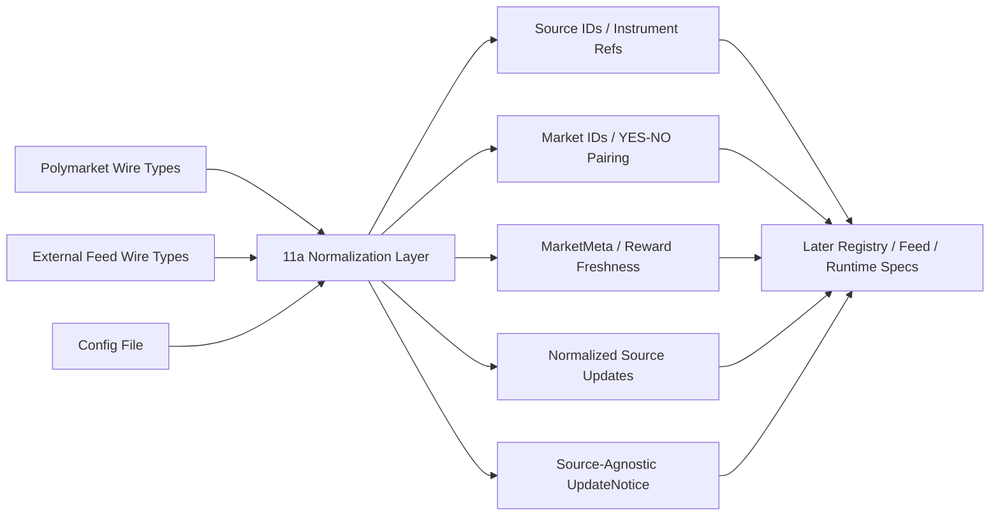

# Spec 11a: Market Foundation, Feed Sources, and Normalized Events

## Priority: MUST HAVE

## Recommended Order

Run this before every other `11x` or `12x` spec.

Reason:

- it defines the shared identity model for markets, instruments, and feed sources
- it removes ambiguity around the numeric/value types both spec families need
- it gives the feed plane and runtime a concrete, low-copy notice boundary

## Implementation References

Use these references for this spec where they apply:

- Official Polymarket docs and the official Rust SDK are the source of truth for market/token identity, public event semantics, and Gamma/CLOB boundary details:
  - https://docs.polymarket.com/api-reference/introduction
  - https://docs.polymarket.com/market-data/overview
  - https://docs.polymarket.com/market-data/websocket/overview
  - https://docs.polymarket.com/api-reference/wss/market
  - https://github.com/Polymarket/rs-clob-client
- In particular, inspect the SDK’s `src/types.rs`, `src/gamma/`, `src/ws/`, and `examples/data.rs` before finalizing identity fields, YES/NO pairing assumptions, or source-update shapes.
- `floor-licker/polyfill-rs` is not the authority for normalized type semantics, but it should still be evaluated when choosing event-envelope shapes that will later sit on hot paths:
  - https://github.com/floor-licker/polyfill-rs

## Problem

The current system knows almost nothing about a market beyond a string `asset_id`, and it implicitly assumes every relevant update comes from one Polymarket public feed.

Today:

- [trigger.rs](/Users/sam/Desktop/Projects/rtt/crates/rtt-core/src/trigger.rs) exposes `OrderBookSnapshot` with only `asset_id`, best bid, best ask, and hash
- [types.rs](/Users/sam/Desktop/Projects/rtt/crates/pm-data/src/types.rs) parses richer Polymarket events, but downstream code loses the `market` identifier and outcome lineage
- [config.rs](/Users/sam/Desktop/Projects/rtt/crates/pm-executor/src/config.rs) only understands a static `[websocket].asset_ids` list
- the previous specs referred to `NormalizedSize` / `NormalizedPriceDelta` / `NormalizedNotional` without defining what those meant

Without a foundation spec, later work will keep inventing slightly different meanings for:

- market identity
- feed-source identity
- external instrument identity
- YES/NO pairing
- reward metadata
- exact decimal values vs hot-path units
- update-notice payloads

## Solution

### Big Task 1: Define shared identity types

Add shared types in `rtt-core` or an equally central crate for:

- `SourceId`
- `SourceKind`
- `InstrumentRef` or equivalent source-scoped subject identifier
- `MarketId`
- `AssetId`
- `OutcomeSide::{Yes, No}`
- `OutcomeToken { asset_id, side }`
- `MarketStatus::{Active, Closed, Suspended, Unknown}`

The system should be able to answer:

- which source produced an update
- which source-scoped instrument or subject the update belongs to
- which two assets belong to the same market
- which one is YES and which one is NO
- whether a market is tradable at all

### Big Task 2: Define the exact-value numeric foundation

This spec should settle the shared numeric question before hot-state work begins.

Use two layers:

1. Exact-value layer for metadata and normalized source updates
   Examples: `Price`, `Size`, `Notional`, `TickSize`, `MinOrderSize`
2. Hot-path units for ticks/lots
   Deferred to Spec 12a, because those depend on market-specific metadata

The main rule is:

- `11a` defines exact normalized values
- `12a` derives market-relative or runtime-relative hot-state units from them

Do not use vague `Normalized*` names without a fixed semantic meaning.

### Big Task 3: Define market metadata and reward freshness

Introduce a stable `MarketMeta` model that can support both generic trading and reward-aware strategies.

It should include at minimum:

- `market_id`
- `yes_asset`
- `no_asset`
- `condition_id` if available
- `tick_size`
- `min_order_size` if available
- `status`
- `reward: Option<RewardParams>`

Reward data must have an explicit freshness state, for example:

- `Fresh`
- `StaleButUsable`
- `Unknown`

That keeps reward-aware strategies from guessing whether missing data is safe to use.

This metadata model is specific to markets where a market-universe concept exists. External reference feeds should not be forced into fake `MarketMeta` records just to fit the type system.

### Big Task 4: Define the normalized source-update model

Introduce a shared normalized update model that works for Polymarket and non-Polymarket sources.

At minimum it must be able to represent:

- Polymarket book updates
- Polymarket price-change deltas
- Polymarket best bid/ask events
- external reference-price updates
- trade/tick updates where relevant
- reconnect/reset events
- source health or stale-data notices if needed

Also define the concrete lightweight notice boundary. This should no longer be implied.

For example:

```rust
pub struct UpdateNotice {
    pub source_id: SourceId,
    pub source_kind: SourceKind,
    pub subject: InstrumentRef,
    pub kind: UpdateKind,
    pub version: u64,
    pub source_hash: Option<String>,
}
```

The exact names may differ, but the notice must identify:

- which source changed
- what class of source it was, without forcing a later resolver lookup just to distinguish Polymarket vs external reference vs other source families
- what changed
- which source-scoped subject changed
- which version the runtime should resolve

For market-bound updates, the normalized payload or resolved state may still carry `market_id` and `asset_id`. The important point is that the notice envelope itself is source-agnostic.

`UpdateKind` should also remain extensible beyond today’s concrete Polymarket event families so later source adapters do not require a breaking redesign just to represent a new public update class.

### Big Task 5: Add the config migration seam

This spec should introduce the new config shape without requiring HTTP discovery yet.

Rules:

- existing `[websocket].asset_ids` configs should continue to parse
- a new additive market-universe config shape should be introduced
- explicit feed-source bindings should be possible for strategies that do not use discovery
- strategies should stop depending on the assumption that `strategy.token_id` always equals one static config entry

This keeps future specs from having to do type migration and runtime migration at the same time.

## Files to Modify

| File | Changes |
|------|---------|
| `crates/rtt-core/src/market.rs` | New: shared market identity/value types |
| `crates/rtt-core/src/feed_source.rs` | New or equivalent: shared source identity and source-scoped subject types |
| `crates/rtt-core/src/public_event.rs` | New or equivalent: normalized source-update model and source-agnostic `UpdateNotice` |
| `crates/rtt-core/src/lib.rs` | Export new shared types |
| `crates/pm-data/src/types.rs` | Map Polymarket wire events into the normalized model instead of exposing only raw parse structs downstream |
| `crates/pm-executor/src/config.rs` | Add backward-compatible market-universe config types plus explicit source-binding shapes |
| `config.toml` | Add commented examples for discovery-backed and explicit-source configs while keeping the legacy example understandable |

## Tests

1. Identity tests: source identity, instrument identity, YES/NO pairing, market-to-asset lookup, and status modeling are deterministic
2. Numeric-type tests: exact-value wrappers serialize/deserialize cleanly and do not lose meaning
3. Metadata tests: `MarketMeta` can represent generic markets and reward-enriched markets without special-case hacks
4. Notice-shape tests: `UpdateNotice` contains enough information for downstream resolution without cloning full ladders and without assuming Polymarket-only identity
5. Event-model tests: Polymarket BBO/book events and external reference/trade events map into the normalized source-update model
6. Config-migration tests: old static `asset_ids` configs still parse while the new market-universe and explicit-source configs also parse

## Acceptance Criteria

- [ ] Shared source identity and source-scoped subject types exist
- [ ] Shared `MarketId` and `AssetId` types exist and YES/NO pairing is explicit
- [ ] Shared exact-value numeric types are defined for metadata/source-update normalization
- [ ] `MarketMeta` and `RewardParams` have stable internal shapes with explicit reward freshness semantics
- [ ] A concrete normalized source-update model exists
- [ ] A concrete lightweight source-agnostic `UpdateNotice` type exists
- [ ] Config parsing has a backward-compatible migration seam for both future market-universe config and explicit source bindings

## Scope Boundaries

- Do NOT implement HTTP discovery in this spec
- Do NOT implement a registry refresh loop in this spec
- Do NOT implement feed-manager subscription diffs in this spec
- Do NOT implement hot-state tick/lot conversion in this spec
- Do NOT implement quote lifecycle in this spec
- Do NOT implement real external feed adapters in this spec; only define the foundation they will plug into

## Block Diagram

Read this left to right:

- wire messages come in from one or more sources with provider-specific fields
- this spec normalizes them into shared internal concepts
- later specs consume those shared concepts instead of reparsing raw strings


