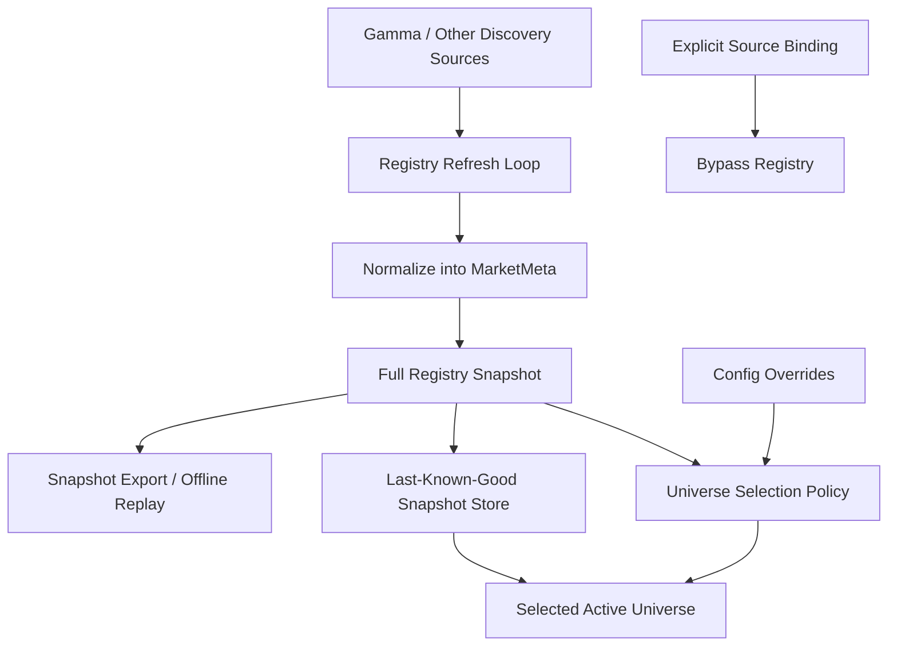

# Spec 11b: Market Registry and Universe Selection

## Priority: MUST HAVE

## Recommended Order

Run this after [specs/11a-market-foundation-and-normalized-events.md](/Users/sam/Desktop/Projects/rtt/specs/11a-market-foundation-and-normalized-events.md).

Reason:

- `11a` defines the model the registry writes into
- this spec builds the control plane without entangling it with WebSocket subscription logic
- this spec applies only where discovery-selected market universes are actually useful

## Implementation References

- Gamma is the canonical live registry source for this spec. Use it for pagination, filters, token pairing, reward metadata, and tick-size/min-size fields:
  - https://gamma-api.polymarket.com/markets
- Official Polymarket docs remain the source of truth for endpoint family boundaries and rate-limit assumptions:
  - https://docs.polymarket.com/api-reference/introduction
- The official Rust SDK is the baseline code reference for Gamma fetching and market/token models:
  - https://github.com/Polymarket/rs-clob-client
  - Inspect `src/gamma/`, `src/types.rs`, and `examples/data.rs`.
- If registry refresh becomes materially expensive, evaluate `polyfill-rs` network-side ideas that are relevant off the hot path as well: connection reuse, prewarming, DNS caching, and request batching/parallelization.
  - https://github.com/floor-licker/polyfill-rs
- PMXT archive data and loader tooling are the preferred historical/offline references for snapshot import/export and deterministic registry replay:
  - https://archive.pmxt.dev/Polymarket
  - https://github.com/pmxt-dev/pmxt
- Supporting open-source repos may inform selection heuristics or slug-to-asset mapping patterns, but they are illustrative only:
  - https://github.com/singhparshant/Polymarket
  - https://github.com/bitman09/Rust-Politics-Sports-Polymarket-Trading-Bot

## Problem

The repo currently has no market registry.

Today:

- the monitored universe is effectively whatever appears in `[websocket].asset_ids`
- there is no selected-universe snapshot, no selection reasons, and no last-known-good registry state
- the current code cannot answer basic control-plane questions such as:
  - which active markets exist
  - which ones are reward-eligible
  - which ones should be excluded and why

This makes future strategy selection brittle and pushes discovery pressure toward the hot path.

It is also important not to overgeneralize this spec:

- reward and market-making strategies may need a market universe
- explicit cross-feed strategies may not
- external reference feeds should not be forced through a fake “market registry” just to fit the architecture

## Solution

### Big Task 1: Build a registry provider abstraction

Create a `MarketRegistry` that:

- fetches market metadata from one or more discovery sources
- normalizes records into the `11a` types
- stores the latest registry snapshot in memory

The provider boundary should let tests supply fixtures without hitting live APIs.

### Big Task 2: Implement discovery, pagination, and backoff

For the first live provider, make the default plan explicit:

- primary discovery: Gamma active-market crawl
- optional enrichment: Gamma and/or public market-detail endpoints as needed

This spec must make pagination and throttling first-class, not implied.

Required behavior:

- explicit page traversal
- configurable refresh cadence
- configurable retry/backoff
- typed handling of malformed or incomplete upstream records

### Big Task 3: Separate normalized registry state from selected universe

The registry should produce two related outputs:

1. full normalized registry snapshot
2. selected active universe with inclusion/exclusion reasons

That split matters because “known market” and “subscribed market” are not the same thing.

Selection should be policy-driven and testable. For example:

- include active markets only
- optionally require reward freshness for reward-aware strategies
- allow explicit config overrides to pin or exclude markets

Cross-feed strategies that bind explicit instruments directly should be able to bypass this registry layer entirely.

### Big Task 4: Add degraded-mode and historical snapshot support

The registry must retain a last-known-good snapshot so upstream failure does not wipe the active universe immediately.

Also add import/export support for deterministic offline use:

- save a normalized registry snapshot
- load a snapshot in tests or backtests

This keeps future replays from depending on live HTTP calls.

## Files to Modify

| File | Changes |
|------|---------|
| `crates/pm-data/src/market_registry.rs` | New: registry orchestration, provider trait, snapshot cache |
| `crates/pm-data/src/registry_provider.rs` | New or equivalent: live/fake provider boundary if separating concerns improves clarity |
| `crates/pm-data/src/snapshot.rs` | New or equivalent: snapshot import/export types |
| `crates/pm-data/src/lib.rs` | Export registry surfaces |
| `crates/pm-executor/src/config.rs` | Add registry refresh, provider, and override config |
| `config.toml` | Add registry configuration examples |

## Tests

1. Fixture tests: upstream records normalize into `MarketMeta` without leaking raw field names downstream
2. Pagination tests: multi-page discovery returns a complete registry snapshot
3. Backoff tests: throttling and transient failures trigger the configured retry policy
4. Quarantine tests: malformed markets are skipped or quarantined without poisoning valid records
5. Last-known-good tests: refresh failure does not erase the previously selected universe
6. Selection tests: include/exclude rules produce deterministic reasons
7. Explicit-binding tests: strategies with explicit source bindings do not require the registry path
8. Snapshot tests: registry snapshots can be saved and loaded for deterministic offline use

## Acceptance Criteria

- [ ] A registry exists as control-plane code separate from the public feed
- [ ] Discovery source handling includes pagination, cadence, and backoff policy
- [ ] The registry stores normalized market metadata using the `11a` types
- [ ] The system can produce a selected active universe plus inclusion/exclusion reasons
- [ ] Strategies that do not depend on discovery can bypass the registry cleanly
- [ ] Last-known-good behavior exists for refresh failure
- [ ] Historical snapshot import/export exists for deterministic offline use

## Scope Boundaries

- Do NOT refactor the WebSocket client into a feed manager in this spec
- Do NOT implement live subscription diffs in this spec
- Do NOT move HTTP discovery into the strategy or trigger path
- Do NOT implement quote lifecycle in this spec
- Do NOT force external reference feeds into the registry abstraction

## Block Diagram

Read this top to bottom:

- HTTP providers feed the registry
- the registry normalizes and caches the full known market set
- a selection policy turns that into the smaller active universe the live feed should care about
- explicit source bindings can bypass this path entirely

