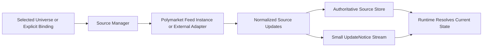

# Spec 11c: Feed Managers and Normalized Source Updates

## Priority: MUST HAVE

## Recommended Order

Run this after [specs/11a-market-foundation-and-normalized-events.md](/Users/sam/Desktop/Projects/rtt/specs/11a-market-foundation-and-normalized-events.md).

Prefer to run it after [specs/11b-market-registry-and-universe-selection.md](/Users/sam/Desktop/Projects/rtt/specs/11b-market-registry-and-universe-selection.md) if the implementation will consume a real selected universe.

Reason:

- `11a` gives this spec the normalized update and notice types it should emit
- `11b` gives this spec a proper active-universe input where discovery matters, but a static adapter can still be used during development

## Implementation References

- Official Polymarket WebSocket docs are the source of truth for market-channel message formats, subscribe payloads, and reconnect/resubscribe semantics:
  - https://docs.polymarket.com/market-data/websocket/overview
  - https://docs.polymarket.com/api-reference/wss/market
- `floor-licker/polyfill-rs` is the primary performance-oriented code reference for this spec’s feed-manager, reconnect, and high-frequency parsing decisions:
  - https://github.com/floor-licker/polyfill-rs
  - Inspect `src/lib.rs`, `src/ws/`, `src/types.rs`, and the orderbook data structures before inventing custom hot-path parsing or reconnect patterns.
  - Optimizations worth explicitly evaluating here: zero-allocation post-warmup WS loops, SIMD JSON parsing, fixed-point conversion at ingress boundaries, bounded depth/state growth, and buffer pooling so the per-message path avoids heap traffic where possible.
- The official Rust SDK is the baseline compatibility reference for WebSocket subscription behavior and public market-data types:
  - https://github.com/Polymarket/rs-clob-client
  - Inspect `src/ws/`, `src/types.rs`, and `CHANGELOG.md`.
- If external reference feeds are added later, this spec should still preserve the same normalized contract instead of copying provider-specific wire shapes into downstream code.

## Problem

The current feed path is too implicit and too Polymarket-specific.

Today:

- [ws.rs](/Users/sam/Desktop/Projects/rtt/crates/pm-data/src/ws.rs) owns one connection and a one-time subscribe list
- [pipeline.rs](/Users/sam/Desktop/Projects/rtt/crates/pm-data/src/pipeline.rs) mutates the order book and then broadcasts cloned `OrderBookSnapshot` values
- informational Polymarket events are parsed but dropped from the downstream contract
- there is no source-agnostic adapter boundary for external reference feeds or dedicated low-latency source instances

That makes the system hard to extend and forces every consumer to pretend BBO snapshots are the whole feed.

## Solution

### Big Task 1: Introduce an explicit feed-manager / source-adapter boundary

Create a `FeedManager` or equivalent top-level owner for one live source instance.

It should own:

- connect / reconnect
- initial subscribe set where applicable
- reset handling on reconnect
- fan-out of normalized source updates and `UpdateNotice`s

Examples of a source instance:

- one shared Polymarket public feed
- one dedicated Polymarket public feed for a latency-sensitive strategy
- one external reference-price feed adapter

This spec is about ownership and event preservation, not global topology planning or feed scaling.

### Big Task 2: Preserve rich normalized source updates end to end

The feed plane must stop discarding event kinds that downstream systems may need later.

Preserve at minimum:

- book snapshots
- price-change deltas
- best bid/ask events
- last trade events
- external reference-price updates
- tick-size changes
- reconnect/reset events

The authoritative state store for each source should still be updated where appropriate, but the rich event stream should survive separately.

### Big Task 3: Keep authoritative source stores and channel payloads small

This spec should stop treating “send full snapshot clone every time” as the only downstream contract.

Required shape:

- feed manager applies normalized updates to the relevant source store
- feed manager emits a small `UpdateNotice`
- downstream consumers resolve the current state they need from the store

For Polymarket, that store is still the order-book store.

For external reference feeds, that store may instead be a reference-price or trade-state store.

This is the seam Spec 12 will build on.

### Big Task 4: Keep source-instance topology opaque to strategies

The downstream contract must not force strategies to know whether their data came from:

- a shared feed instance
- a dedicated feed instance
- Polymarket
- an external reference venue

This spec only needs to make that opacity possible by standardizing the per-source-instance output contract. The strategy-driven topology planner belongs later in `12b`.

### Big Task 5: Support conservative universe reconfiguration where applicable

If the selected universe changes, the first implementation may use a conservative full reconfigure path:

- stop or reset the current subscription set
- apply the new desired full set
- resume normal processing

This spec does not need to solve fine-grained in-place add/remove diffs yet. That is what `11d` is for.

## Files to Modify

| File | Changes |
|------|---------|
| `crates/pm-data/src/feed.rs` | New: feed-manager orchestration surface and source-adapter boundary |
| `crates/pm-data/src/ws.rs` | Narrow to Polymarket connection/session behavior under feed-manager ownership |
| `crates/pm-data/src/pipeline.rs` | Emit normalized source updates and `UpdateNotice`s instead of only cloned snapshots |
| `crates/pm-data/src/orderbook.rs` | Remain the authoritative Polymarket depth store while supporting notice-based resolution |
| `crates/pm-data/src/reference_store.rs` | New or equivalent if external reference state needs a separate authoritative store abstraction |
| `crates/pm-data/src/lib.rs` | Export feed-manager surfaces |
| `crates/pm-executor/src/main.rs` | Wire the feed manager instead of the implicit pipeline-only flow |

## Tests

1. Feed-manager tests: per-source-instance ownership is explicit and reconnect/reset behavior stays correct
2. Adapter tests: Polymarket and external source adapters can emit the same normalized update/notice contract
3. Event-preservation tests: informational event kinds survive end to end in normalized form
4. Notice-path tests: downstream consumers receive small notices and can resolve state from the authoritative source store
5. Store-authority tests: full depth or reference state remains available from the relevant store after normalized updates are applied
6. Reconfigure tests: a full selected-universe change can be applied via a conservative reset/reconfigure path where applicable

## Acceptance Criteria

- [ ] Each live source instance has an explicit top-level owner
- [ ] Rich normalized update kinds are preserved across supported source types
- [ ] The authoritative source store remains available for downstream resolution
- [ ] Downstream consumers can use `UpdateNotice` rather than cloned full snapshots by default
- [ ] Strategies are insulated from whether a source instance is shared or dedicated
- [ ] Registry-backed feeds can conservatively reconfigure around a changed full universe without pretending fine-grained diffing already exists

## Scope Boundaries

- Do NOT implement batched live add/remove diffs in this spec
- Do NOT implement multi-connection sharding in this spec
- Do NOT implement control-plane market ranking in this spec
- Do NOT implement hot-state or quote-runtime behavior in this spec
- Do NOT implement full strategy-driven topology planning in this spec

## Block Diagram

Read this left to right:

- each source manager owns one live source instance
- the source manager emits the same normalized contract regardless of provider
- the relevant store keeps source state authoritative, while notices stay small for downstream consumers

