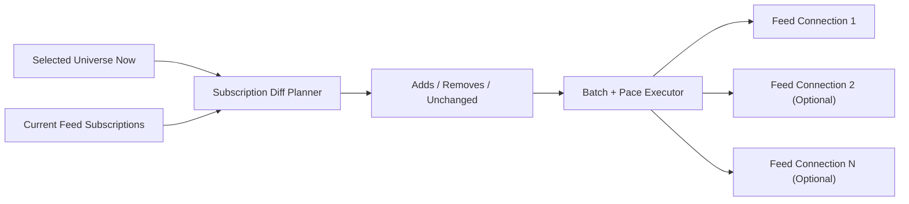

# Spec 11d: Dynamic Subscription Diffs and Feed Scaling

## Priority: SHOULD HAVE AFTER FIRST MULTI-MARKET PASS

## Recommended Order

Run this after [specs/11c-feed-manager-and-normalized-public-updates.md](/Users/sam/Desktop/Projects/rtt/specs/11c-feed-manager-and-normalized-public-updates.md) and only after current Polymarket WebSocket semantics have been verified during implementation.

Reason:

- the repo first needs a correct feed manager
- only then is it worth building live diffing, pacing, and scaling behavior on top

## Implementation References

- Official Polymarket WebSocket docs are the source of truth for whether live subscribe/unsubscribe diffs are actually supported and how `assets_ids` changes are expressed:
  - https://docs.polymarket.com/market-data/websocket/overview
  - https://docs.polymarket.com/api-reference/wss/market
- `floor-licker/polyfill-rs` is the primary performance-oriented code reference for subscription-diff handling, reconnect behavior, and low-allocation feed scaling patterns:
  - https://github.com/floor-licker/polyfill-rs
  - Inspect `src/ws/` and the benchmark/examples before committing to any batch/pacing design.
  - In particular, evaluate whether its buffer pooling, connection reuse, and post-warmup zero-allocation handling patterns can be reused before building a custom diff executor.
- The official Rust SDK is the baseline compatibility reference for current public subscription behavior:
  - https://github.com/Polymarket/rs-clob-client
  - Inspect `src/ws/` and `CHANGELOG.md`.
- Do not assume unsubscribe support, server acknowledgements, or shard-worthy connection limits unless one of the official references above actually confirms them.

## Problem

Dynamic subscription changes are not a trivial extension of `11c`.

The original monolithic spec bundled:

- add/remove diffing
- batching
- pacing and anti-thrash logic
- multi-connection sharding

That is a connection manager in its own right.

If implemented too early, this work becomes guesswork around undocumented or partially verified exchange behavior.

## Solution

### Big Task 1: Verify and isolate subscribe/unsubscribe semantics

Before writing the diff engine, confirm:

- whether unsubscribe is supported
- how the server acknowledges or applies changes
- what reconnect/resubscribe guarantees exist

Encode those semantics behind a small adapter so the rest of the code does not depend on guesswork.

### Big Task 2: Implement a deterministic subscription diff planner

Given:

- current subscription state
- desired subscription state

The planner should produce:

- adds
- removes
- unchanged

This planner should be pure, deterministic, and heavily unit tested.

### Big Task 3: Add batching and pacing

The executor for the diff plan should support:

- bounded batch sizes
- configurable pacing delays
- protection against registry churn causing repeated large resubscribe storms

This is operational safety work, not a hot-path optimization.

### Big Task 4: Add optional connection sharding

If measured need or documented limits justify it, allow the desired universe to be spread across multiple feed sessions.

Required properties:

- stable shard assignment
- explicit configuration
- visibility into which markets live on which connection

Sharding should be optional. A single-connection path remains the default unless evidence says otherwise.

## Files to Modify

| File | Changes |
|------|---------|
| `crates/pm-data/src/feed.rs` | Add subscription-plan execution, pacing, and optional shard ownership |
| `crates/pm-data/src/ws.rs` | Support verified subscribe/unsubscribe commands under feed-manager control |
| `crates/pm-data/src/subscription_plan.rs` | New or equivalent: pure desired-vs-current diff planner |
| `crates/pm-executor/src/config.rs` | Add batch, pacing, and optional sharding configuration |
| `config.toml` | Add feed-scaling examples |

## Tests

1. Semantics tests: verified subscribe/unsubscribe behavior is encoded behind a stable adapter
2. Diff-planner tests: adds/removes/unchanged sets are deterministic
3. Batching tests: large universe changes are broken into bounded steps
4. Pacing tests: rapid registry churn does not cause uncontrolled resubscribe storms
5. Shard-assignment tests: markets are assigned stably across configured connections

## Acceptance Criteria

- [ ] Live subscription-change behavior is based on verified exchange semantics
- [ ] A deterministic diff planner exists for desired-vs-current subscriptions
- [ ] Batch and pacing controls exist to avoid subscription thrash
- [ ] Optional connection sharding exists behind explicit configuration
- [ ] The default single-connection path remains supported

## Scope Boundaries

- Do NOT implement market discovery in this spec
- Do NOT redesign the normalized event model in this spec
- Do NOT implement strategy runtime or quote lifecycle here
- Do NOT add sharding without measurement or verified operational need

## Block Diagram

Read this left to right:

- the registry says what the feed should want now
- the planner compares that with what the feed already has
- the executor applies changes carefully instead of reconnecting blindly

