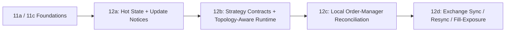

# Spec 12: Hot State and Quote Lifecycle (Overview)

## Priority: MUST HAVE

This umbrella spec replaces the old monolithic work order for runtime state, strategy contracts, and quote management.

It is intentionally split because the original version bundled:

- hot-state normalization
- notice-based runtime fan-out
- strategy trait redesign
- strategy-driven feed/data requirement declaration
- quote-intent types
- deterministic reconciliation
- exchange resync and fill/exposure handling

Those are tightly related, but they do not need to ship as one unit.

## Split Specs

1. [specs/12a-hot-state-and-update-notices.md](/Users/sam/Desktop/Projects/rtt/specs/12a-hot-state-and-update-notices.md)
   Why first: it creates the normalized hot-state store and low-copy runtime boundary.
2. [specs/12b-strategy-contracts-and-runtime-scaffolding.md](/Users/sam/Desktop/Projects/rtt/specs/12b-strategy-contracts-and-runtime-scaffolding.md)
   Why second: it separates trigger strategies from quote strategies, makes strategy requirements explicit, and keeps the current trigger path working.
3. [specs/12c-order-manager-local-reconciliation.md](/Users/sam/Desktop/Projects/rtt/specs/12c-order-manager-local-reconciliation.md)
   Why third: it adds a deterministic, network-free order-manager core for desired-vs-local state.
4. [specs/12d-exchange-sync-and-fill-exposure-seam.md](/Users/sam/Desktop/Projects/rtt/specs/12d-exchange-sync-and-fill-exposure-seam.md)
   Why fourth: exchange-observed state, resync, rate limits, and fill/exposure propagation are separate adapter work and should stay separate.

## Dependency Notes

- `12a` only needs the shared foundation from `11a`, plus a live feed implementation from `11c` when wired end to end.
- `12b` depends on `12a`, not on the full order-manager stack.
- `12b` is where feed/data requirements and topology provisioning become explicit for strategies.
- trigger-only / taker-style strategies should be able to ship with `12a + 12b` alone; they do not require `12c` or `12d` unless they introduce resting quote state or exchange-state reconciliation requirements.
- `12c` is intentionally pure local logic first.
- `12d` is the first spec that truly requires exchange-observed order state.

## Reference Sweep

The following references should be treated as required inputs where applicable:

- Official Polymarket docs are the source of truth for order semantics, L2 authentication requirements, and any documented user/order event behavior:
  - https://docs.polymarket.com/trading/orders/create
  - https://docs.polymarket.com/api-reference/authentication
- `floor-licker/polyfill-rs` is the primary performance-oriented code reference for hot-state normalization, high-frequency WS/user-event parsing, and low-allocation order/lifecycle paths:
  - Carry forward concrete ideas from that repo where they fit: zero-allocation post-warmup event loops, fixed-point conversion at ingress boundaries, integer-based hot-state representations, bounded hot data structures, buffer pooling, and connection reuse/prewarming on authenticated command paths.
  - https://github.com/floor-licker/polyfill-rs
- `Polymarket/rs-clob-client` is the baseline official Rust SDK reference for order builders, types, authenticated command flow, and example lifecycle wiring:
  - https://github.com/Polymarket/rs-clob-client
- Supporting open-source bots may inform reconciliation and quote-maintenance patterns, but they are illustrative only and must not override official docs or SDK behavior:
  - https://github.com/singhparshant/Polymarket
  - https://github.com/HyperBuildX/Polymarket-Trading-Bot-Rust
  - https://github.com/bitman09/Rust-Politics-Sports-Polymarket-Trading-Bot

## Done When

This umbrella spec is complete when:

- the runtime uses normalized hot state rather than string-heavy snapshots as its primary boundary
- trigger and quote strategies have separate, explicit contracts
- strategies can declare feed/data requirements without knowing whether feeds are shared or dedicated
- the order manager has a deterministic local core
- exchange divergence, resync, and fill/exposure propagation are handled in a follow-on spec instead of being hand-waved inside the local core

## Scope Boundaries

- Do NOT block hot-state work on full quote-lifecycle completion
- Do NOT mix pure reconciliation logic with exchange adapter logic in one work order
- Do NOT remove the current one-shot trigger path without a compatibility story
- Do NOT claim hot-path performance wins without measuring the relevant layer

## Block Diagram

Read this left to right:

- `12a` creates the runtime’s fast local view of source-backed state
- `12b` defines what strategies can ask for, how the runtime provisions it, and what strategies return
- trigger-only strategies can stop there if they do not maintain resting quote state
- `12c` turns desired quotes into local command plans
- `12d` closes the loop with the exchange and fill/exposure updates

