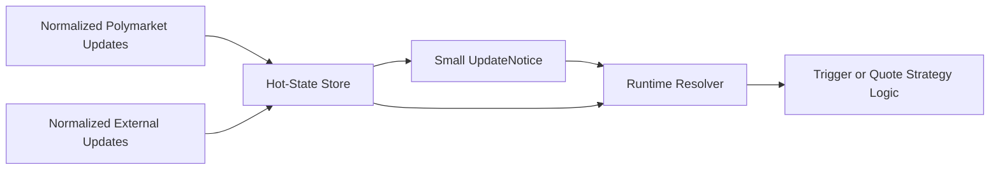

# Spec 12a: Hot State and Update Notices

## Priority: MUST HAVE

## Recommended Order

Run this after [specs/11a-market-foundation-and-normalized-events.md](/Users/sam/Desktop/Projects/rtt/specs/11a-market-foundation-and-normalized-events.md).

Wire it to the live feed after [specs/11c-feed-manager-and-normalized-public-updates.md](/Users/sam/Desktop/Projects/rtt/specs/11c-feed-manager-and-normalized-public-updates.md).

Reason:

- `11a` defines the exact-value market/event model plus source-agnostic update identity
- this spec converts those shared values into runtime-friendly hot state

## Implementation References

- `floor-licker/polyfill-rs` is the primary performance-oriented code reference for this spec, especially when deciding how normalized updates become runtime-hot state without repeated allocation or string parsing:
  - https://github.com/floor-licker/polyfill-rs
  - Inspect `src/types.rs`, `src/ws/`, and the examples before inventing bespoke hot-path parsing or state-update machinery.
  - The relevant optimization themes are explicit: fixed-point conversion at ingress boundaries, integer-based internal state, zero-allocation post-warmup update loops, bounded hot structures, and cache-friendly state layout.
- The official Rust SDK is the baseline compatibility reference for public event and order-side data structures that hot state may need to project:
  - https://github.com/Polymarket/rs-clob-client
- Use this spec to derive runtime units from `11a` exact values, not to redefine exchange or market semantics that should come from the official docs and SDK.

## Problem

The current runtime boundary is too heavy, too string-oriented, and too single-source.

Today:

- [trigger.rs](/Users/sam/Desktop/Projects/rtt/crates/rtt-core/src/trigger.rs) defines `OrderBookSnapshot` using decimal strings
- [pipeline.rs](/Users/sam/Desktop/Projects/rtt/crates/pm-data/src/pipeline.rs) clones snapshots through channels
- [runner.rs](/Users/sam/Desktop/Projects/rtt/crates/pm-strategy/src/runner.rs) receives full snapshots rather than small notices and local state lookups
- the runtime has no generic way to resolve a combined state view from multiple source types

That means:

- repeated parsing work at the strategy boundary
- unnecessary snapshot movement through channels
- no explicit normalized state store for fast reads
- no source-agnostic place to hold both Polymarket state and external reference state

## Solution

### Big Task 1: Define the hot-state model

Add a runtime-local state model that derives runtime-friendly units from the exact-value types introduced in `11a`.

Examples:

- `price_ticks`
- `size_lots`
- precomputed best bid / best ask / midpoint
- reference-price state
- small cached depth slices if required
- recent trade/reference aggregates if required

This spec is where market-relative or runtime-relative units belong. They should not have been defined earlier.

### Big Task 2: Build an authoritative hot-state store

The runtime should have a fast read path into the current normalized source-backed state.

Required properties:

- keyed by source and subject, with market-specific lookup available where relevant
- updated from normalized source updates
- readable without repeated string parsing

The hot-state store may be one composite store or several coordinated source stores behind one runtime resolver. The important point is that it is the runtime authority. Channel messages should only tell consumers what changed.

### Big Task 3: Implement the notice-driven runtime boundary

Use the `UpdateNotice` defined in `11a` as the small handoff object.

The new path should be:

- one or more source managers apply normalized updates
- hot-state store updates in place
- runtime receives a small notice
- runtime resolves the current strategy-relevant state from the store

This replaces “clone a full snapshot and send it everywhere” as the default path.

### Big Task 4: Measure the cost of the new boundary

This spec changes the hot path, so it must prove it is not making the runtime meaningfully worse.

Require:

- replay or microbenchmark coverage over a fixed update stream
- allocation-sensitive checks for the notice + resolver path
- comparison against the current snapshot-based trigger path

## Files to Modify

| File | Changes |
|------|---------|
| `crates/rtt-core/src/hot_state.rs` | New or equivalent: normalized runtime state types |
| `crates/pm-data/src/pipeline.rs` | Update the handoff to feed notices and hot-state updates |
| `crates/pm-strategy/src/runtime.rs` | New: hot-state resolver/runtime surface |
| `crates/pm-strategy/src/backtest.rs` | Support replay through hot-state and notice-driven paths |
| `crates/pm-executor/src/main.rs` | Wire the new runtime boundary while keeping the old path available during transition |

## Tests

1. Conversion tests: normalized source updates convert into hot-state values without repeated runtime string parsing
2. Multi-source tests: Polymarket state and external reference state can coexist in the hot-state layer without type confusion
3. Notice tests: the runtime can resolve current state from `UpdateNotice` plus the hot-state store
4. Compatibility tests: the existing trigger path can still operate during migration
5. Benchmark/replay tests: a fixed update stream can compare snapshot-path vs notice-path behavior

## Acceptance Criteria

- [ ] A normalized hot-state model exists for runtime use
- [ ] The hot-state store is authoritative for runtime reads
- [ ] The hot-state layer can represent more than one source type without leaking provider-specific wire details into strategies
- [ ] The runtime can consume small notices instead of full cloned snapshots by default
- [ ] Benchmark or replay evidence exists for the new boundary

## Scope Boundaries

- Do NOT redesign strategy traits in this spec
- Do NOT implement quote reconciliation in this spec
- Do NOT implement exchange resync in this spec
- Do NOT remove the old snapshot-based path until later specs provide a safe migration

## Block Diagram

Read this left to right:

- one or more source managers update shared normalized values
- the hot-state store turns them into fast runtime values
- the runtime sees a small notice and reads whatever detail it actually needs

