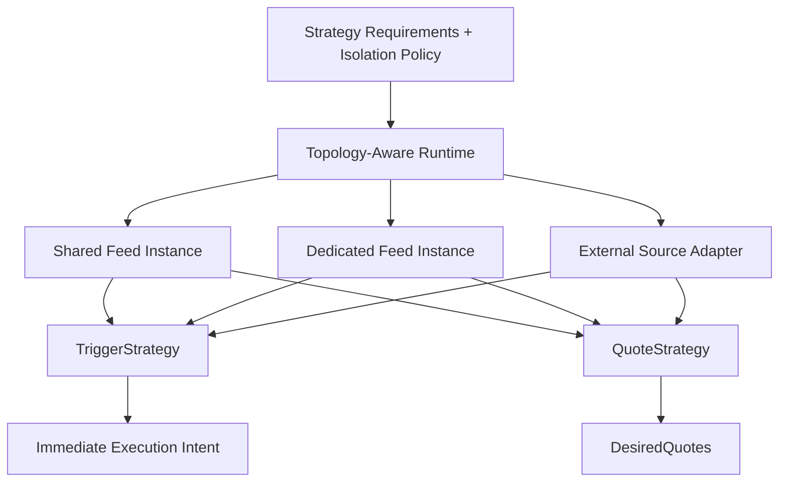

# Spec 12b: Strategy Contracts and Runtime Scaffolding

## Priority: MUST HAVE

## Recommended Order

Run this after [specs/12a-hot-state-and-update-notices.md](/Users/sam/Desktop/Projects/rtt/specs/12a-hot-state-and-update-notices.md).

Reason:

- this spec should consume the normalized hot-state path rather than invent its own runtime boundary

## Implementation References

- Use `floor-licker/polyfill-rs` as the primary performance-oriented reference when evaluating high-frequency update fan-in and lifecycle-event handling at the runtime boundary:
  - https://github.com/floor-licker/polyfill-rs
- Use the official Rust SDK as the baseline reference for authenticated order/event types and the data shapes strategies may ultimately need:
  - https://github.com/Polymarket/rs-clob-client
- Supporting open-source bots may be consulted for strategy/runtime composition patterns, but they are illustrative only:
  - https://github.com/singhparshant/Polymarket
  - https://github.com/HyperBuildX/Polymarket-Trading-Bot-Rust

## Problem

The current strategy API forces every strategy into the same shape and hides feed-topology needs that matter for latency-sensitive strategies.

Today:

- [strategy.rs](/Users/sam/Desktop/Projects/rtt/crates/pm-strategy/src/strategy.rs) exposes one trait that returns at most one `TriggerMessage`
- [runner.rs](/Users/sam/Desktop/Projects/rtt/crates/pm-strategy/src/runner.rs) assumes one snapshot in, one optional trigger out
- there is no place for a strategy to declare “I need Polymarket BBO plus an external reference price”
- there is no place for a latency-sensitive strategy to express an isolation/performance requirement without knowing transport details

That is fine for simple taker-style triggers. It is the wrong abstraction for resting quotes and cross-feed trigger strategies.

## Solution

### Big Task 1: Split strategy contracts by behavior

Add separate strategy contracts, for example:

- `TriggerStrategy`
- `QuoteStrategy`

The main rule is:

- trigger strategies return immediate execution intent
- quote strategies return desired quote state

Do not force both into one vague catch-all output enum if that hides the behavioral difference.

### Big Task 2: Add strategy requirements, execution mode, and topology hints

Strategies should declare what data they need and how sensitive they are to feed sharing/isolation.

Examples:

- `polymarket_bbo`
- `polymarket_depth_top_n`
- `external_reference_price`
- `recent_trades`
- `reward_metadata`
- `inventory` or `live_order_state`

The strategy contract should also make execution mode explicit, for example:

- `ExecutionMode::Trigger`
- `ExecutionMode::Quote`

And it should allow a strategy to express performance/isolation requirements without naming a transport plan directly.

For example:

- shared feed acceptable
- dedicated feed preferred
- dedicated feed required

The rule is:

- strategies declare requirements and latency/isolation policy
- the runtime decides whether that becomes a shared or dedicated source instance

### Big Task 3: Add runtime topology provisioning and merged-update wiring

The runtime scaffolding should translate strategy requirements into provisioned inputs.

That means it must be able to:

- provision one or more source instances
- decide whether a Polymarket feed is shared or dedicated
- attach external source adapters where required
- merge notices from multiple sources into one strategy evaluation loop

The strategy should consume a uniform runtime view. It should not know whether the reference price came from Binance, another venue, or a replay fixture unless the strategy explicitly requested that distinction.

### Big Task 4: Add shared runtime scaffolding

Even though the contracts differ, the surrounding runtime should share:

- update filtering
- metrics/tracing hooks
- back-pressure handling
- state-resolution plumbing

This prevents the trigger path and quote path from becoming two unrelated frameworks.

### Big Task 5: Preserve backward compatibility

Threshold and spread strategies should continue to work.

That likely means:

- adapters from the old trait to the new trigger-strategy contract
- migration of tests and backtests without a flag-day rewrite

## Files to Modify

| File | Changes |
|------|---------|
| `crates/pm-strategy/src/strategy.rs` | Split or extend the strategy contracts |
| `crates/pm-strategy/src/quote.rs` | New: quote-strategy-facing types |
| `crates/pm-strategy/src/runtime.rs` | Extend runtime scaffolding for both strategy classes plus topology-aware provisioning |
| `crates/pm-strategy/src/backtest.rs` | Support trigger and quote strategy replay paths |
| `crates/rtt-core/src/intent.rs` | New or equivalent: shared immediate intent types if needed across crates |
| `crates/rtt-core/src/strategy_requirements.rs` | New or equivalent: shared requirement, execution-mode, and isolation-policy types if centralizing them improves clarity |

## Tests

1. Trigger-compatibility tests: existing trigger strategies still work through the new runtime
2. Quote-contract tests: a simple quote strategy can produce `DesiredQuotes` without network access
3. Single-feed requirement tests: a strategy can declare one-feed requirements and receive the correct runtime view
4. Cross-feed requirement tests: a strategy can declare Polymarket plus external requirements and consume merged updates uniformly
5. Topology tests: a strategy can request shared-acceptable vs dedicated-required behavior without embedding transport knowledge
6. Backtest tests: replay works for both strategy classes through shared scaffolding

## Acceptance Criteria

- [ ] Trigger and quote strategies have separate explicit contracts
- [ ] Strategies can declare feed/data requirements and execution mode
- [ ] Strategies can declare latency/isolation requirements without embedding transport details
- [ ] The runtime can provision single-feed and cross-feed strategy inputs from those declarations
- [ ] Shared runtime scaffolding exists around both strategy classes
- [ ] Existing trigger strategies continue to run without a flag-day rewrite

## Scope Boundaries

- Do NOT implement quote reconciliation in this spec
- Do NOT implement exchange-resync logic in this spec
- Do NOT redesign the transport or order-dispatch hot path in this spec
- Do NOT force strategies to know whether a feed instance is shared or dedicated

## Block Diagram

Read this top to bottom:

- the strategy declares the data and latency behavior it needs
- the runtime provisions one or more source inputs and merges them
- trigger strategies and quote strategies produce different outputs on purpose

