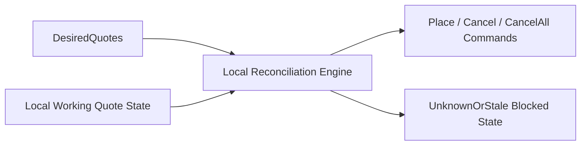

# Spec 12c: Order Manager Local Reconciliation

## Priority: MUST HAVE FOR RESTING-QUOTE STRATEGIES

## Recommended Order

Run this after [specs/12b-strategy-contracts-and-runtime-scaffolding.md](/Users/sam/Desktop/Projects/rtt/specs/12b-strategy-contracts-and-runtime-scaffolding.md).

Reason:

- this spec consumes `DesiredQuotes`
- it focuses only on the deterministic local core, not exchange adapters

## Implementation References

- Official Polymarket order docs are the source of truth for order semantics that the local planner must respect, including `client_order_id` requirements and order-type behavior:
  - https://docs.polymarket.com/trading/orders/create
  - https://docs.polymarket.com/api-reference/authentication
- The official Rust SDK is the baseline code reference for limit-order builders, side/price/size fields, and authenticated command examples:
  - https://github.com/Polymarket/rs-clob-client
  - Inspect `src/types.rs` and `examples/clob/`.
- `floor-licker/polyfill-rs` should be evaluated before introducing extra allocation into quote-command building:
  - https://github.com/floor-licker/polyfill-rs
  - The useful ideas here are not only API compatibility; they include fixed-point internal representations, low-allocation command construction, and buffer reuse on high-frequency lifecycle paths.
- Supporting open-source bots may inform deterministic local quote-maintenance patterns, but they are illustrative only:
  - https://github.com/singhparshant/Polymarket
  - https://github.com/HyperBuildX/Polymarket-Trading-Bot-Rust
  - https://github.com/bitman09/Rust-Politics-Sports-Polymarket-Trading-Bot

## Problem

The system currently has no local quote-lifecycle engine.

Today:

- execution goes directly from a `TriggerMessage` to order submission
- there is no concept of desired quote state vs local working state
- there is no deterministic diff engine that can say “place this, cancel that, do nothing here”

Trying to solve local reconciliation and exchange recovery in one spec would make this too large again.

## Solution

### Big Task 1: Define explicit quote and command types

Add types for:

- `DesiredQuotes`
- `DesiredQuote`
- `WorkingQuote`
- `QuoteId`
- `ExecutionCommand::{Place, Cancel, CancelAll}`

Do not add `Hedge` here. Hedge accounting belongs to later work.

### Big Task 2: Define the local lifecycle state machine

The order manager needs explicit local states, for example:

- `PendingSubmit`
- `Working`
- `PendingCancel`
- `Canceled`
- `Rejected`
- `UnknownOrStale`

The important part is not only the naming. It is that uncertainty is a first-class state in v1.

Rules for this spec:

- `UnknownOrStale` must exist from day one
- v1 may enter `UnknownOrStale` via explicit test injection or controlled local hooks
- the full production transition set into that state, such as reconnect or timeout paths, is deferred to `12d`

### Big Task 3: Implement deterministic desired-vs-local reconciliation

Given:

- desired quote state
- local working quote state

The reconciliation engine should issue the minimal command set to converge when local state is trustworthy:

- place missing quotes
- cancel stale quotes
- replace materially changed quotes via cancel + place
- no-op where appropriate

If local state is not trustworthy, the engine should enter a blocked `UnknownOrStale` path rather than guess.

In v1, that means:

- no speculative convergence when a quote is `UnknownOrStale`
- explicit surfaced status that higher layers can inspect in tests
- recovery mechanics are deferred to `12d`

### Big Task 4: Add anti-thrash protections inside the local planner

The local core should avoid issuing runaway command churn when desired quotes flap quickly.

This is still pure local logic. Examples:

- per-strategy-instance material-change thresholds
- deterministic command ordering
- per-strategy-instance cooldown or coalescing rules if justified

## Files to Modify

| File | Changes |
|------|---------|
| `crates/pm-executor/src/order_manager.rs` | New: local reconciliation engine |
| `crates/pm-executor/src/order_state.rs` | New or equivalent: local quote state machine |
| `crates/rtt-core/src/intent.rs` | Extend with quote command types if shared across crates |
| `crates/pm-strategy/src/quote.rs` | Align quote types with the order-manager input boundary |

## Tests

1. Reconciliation tests: place-new, cancel-stale, replace-changed, and no-op behavior are deterministic
2. Lifecycle tests: local states transition correctly for happy-path local flows
3. Uncertainty tests: an explicitly injected `UnknownOrStale` quote prevents speculative command emission
4. Anti-thrash tests: repeated small desired-state changes do not produce runaway commands
5. Instance-policy tests: two quote-strategy instances can use different anti-thrash parameters without interfering with each other

## Acceptance Criteria

- [ ] Explicit quote and command types exist for the order manager
- [ ] The local lifecycle/state-machine is explicit
- [ ] Desired-vs-local reconciliation is deterministic and testable without the network
- [ ] `UnknownOrStale` exists as a first-class local state in v1
- [ ] Uncertain local state halts speculative convergence
- [ ] Anti-thrash controls can be configured per quote-strategy instance

## Scope Boundaries

- Do NOT implement exchange-observed reconciliation in this spec
- Do NOT implement reconnect/resync adapters in this spec
- Do NOT implement fill accounting or hedging in this spec
- Do NOT rely on private WebSocket assumptions in this spec
- Do NOT defer the uncertainty state itself to a later spec; only defer the production entry/recovery paths

## Block Diagram

Read this left to right:

- a quote strategy says what it wants
- the local order manager compares that with what it thinks is already working
- it emits the minimal command plan, unless local state is explicitly `UnknownOrStale`

