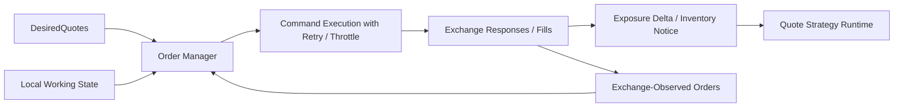

# Spec 12d: Exchange Sync and Fill/Exposure Seam

## Priority: MUST HAVE BEFORE LIVE RESTING-QUOTE TRADING

## Recommended Order

Run this after [specs/12c-order-manager-local-reconciliation.md](/Users/sam/Desktop/Projects/rtt/specs/12c-order-manager-local-reconciliation.md).

Reason:

- `12c` builds the local core
- this spec adds the exchange-observed side and recovery behavior the local core intentionally deferred

## Implementation References

- Official Polymarket docs are the source of truth for authenticated command requirements and documented order semantics:
  - https://docs.polymarket.com/trading/orders/create
  - https://docs.polymarket.com/api-reference/authentication
- The official Rust SDK is the baseline code reference for authenticated order placement, cancel/replace flow, and any available user-order event handling:
  - https://github.com/Polymarket/rs-clob-client
  - Inspect `src/types.rs` and `examples/clob/`.
- `floor-licker/polyfill-rs` is the primary performance-oriented reference for low-allocation order/lifecycle paths and high-frequency event parsing:
  - https://github.com/floor-licker/polyfill-rs
  - Evaluate its zero-allocation post-warmup event handling, buffer pooling, connection reuse/prewarming, and fixed-point/internal integer patterns before building custom exchange-sync machinery.
- Supporting open-source bots may inform reconciliation, monitoring, and fill/exposure propagation patterns, but they are illustrative only:
  - https://github.com/singhparshant/Polymarket
  - https://github.com/HyperBuildX/Polymarket-Trading-Bot-Rust
  - https://github.com/bitman09/Rust-Politics-Sports-Polymarket-Trading-Bot

## Problem

Local order state is not authoritative forever.

Real systems have:

- reconnects
- missed acknowledgements
- out-of-order cancel confirmations
- rate limits
- fills that change inventory

If those cases are not modeled explicitly, the local planner will either guess or drift.

## Solution

### Big Task 1: Add an exchange-observed state provider

Until a dedicated private/user-feed spec exists, this spec should use a documented authenticated source for exchange state.

That provider may use:

- polling
- explicit resync endpoints
- later replacement by a private stream adapter

The important part is that exchange-observed state becomes a real input to the order manager.

### Big Task 2: Close the three-way reconciliation loop

The order manager should now reason over:

- desired state
- local working state
- exchange-observed state

This spec defines what happens when they disagree.

This spec also owns the real production transitions into and out of the `UnknownOrStale` state introduced in `12c`.

Examples:

- local says working, exchange says missing
- local says pending cancel, exchange says already canceled
- local state is stale after reconnect
- local state times out waiting for confirmation and must become `UnknownOrStale`

### Big Task 3: Add retry, backoff, and throttling rules

The command layer should become rate-limit aware.

Required behavior:

- retry/backoff for safe command retries
- bounded retry policy
- command throttling so quote maintenance does not thrash the CLOB

### Big Task 4: Add the minimal fill/exposure seam

This spec still does not implement full P&L or hedge logic.

It does define the seam for:

- ingesting fill/update events
- recording minimal per-market or per-side exposure deltas
- notifying quote strategies that inventory has changed

That keeps later hedge/risk work additive.

## Files to Modify

| File | Changes |
|------|---------|
| `crates/pm-executor/src/order_manager.rs` | Extend from local-only reconciliation to three-way reconciliation |
| `crates/pm-executor/src/order_state.rs` | Add exchange-observed state merge and resync helpers |
| `crates/pm-executor/src/execution.rs` | Support retry/backoff/throttling-aware command execution where appropriate |
| `crates/pm-strategy/src/runtime.rs` | Surface minimal inventory/exposure changes back to quote strategies |
| `crates/rtt-core/src/intent.rs` | Extend shared intent/update types if needed |

## Tests

1. Divergence tests: local and exchange-observed state disagreements resolve into defined recovery behavior
2. Reconnect/timeout tests: stale local state transitions into `UnknownOrStale` and then follows explicit resync behavior
3. Out-of-order tests: acknowledgements/cancel confirmations do not leave impossible order state
4. Throttling tests: reconciliation does not emit unbounded command storms under rate pressure
5. Fill/exposure tests: minimal exposure deltas are recorded and surfaced without full hedge accounting

## Acceptance Criteria

- [ ] Exchange-observed order state is a real order-manager input
- [ ] Reconnect, timeout, stale-state, and out-of-order cases have defined recovery behavior
- [ ] Production transitions into and out of `UnknownOrStale` are defined here rather than invented ad hoc
- [ ] Retry/backoff/throttling behavior exists for quote-maintenance commands
- [ ] A minimal fill/exposure seam exists for future hedge and inventory work

## Scope Boundaries

- Do NOT implement full hedge logic in this spec
- Do NOT implement full P&L accounting in this spec
- Do NOT assume a private user WebSocket exists if the documented implementation path is polling/resync
- Do NOT redesign the local reconciliation core if the problem can be solved in the exchange adapter layer

## Block Diagram

Read this left to right:

- the local order manager no longer trusts itself alone
- it compares local belief with exchange-observed truth
- fills feed a small exposure signal back to quote strategies

