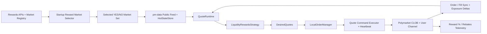

# Spec 13: Low-Risk Liquidity Rewards Portfolio Strategy

## Priority: MUST HAVE FOR FIRST LIVE QUOTE STRATEGY

## Recommended Order

Run this after [12d-exchange-sync-and-fill-exposure-seam.md](12d-exchange-sync-and-fill-exposure-seam.md).

Reason:

- this spec depends on the explicit quote-strategy contract from `12b`
- it needs the local reconciliation and uncertainty handling from `12c`
- it needs exchange-observed order/fill state and exposure deltas from `12d`
- it should be the first production path that wires `QuoteRuntime` into `pm-executor`

## Implementation References

Use the official Polymarket docs as the source of truth for reward math, quoting rules, heartbeat behavior, and monitoring endpoints:

- Liquidity rewards methodology and scoring:
  - https://docs.polymarket.com/market-makers/liquidity-rewards
- Market-maker trading guidance:
  - https://docs.polymarket.com/market-makers/trading
- Maker rebates program:
  - https://docs.polymarket.com/market-makers/maker-rebates
- Orders overview, including heartbeat and order scoring:
  - https://docs.polymarket.com/trading/orders/overview
- Current active rewards configs:
  - https://docs.polymarket.com/api-reference/rewards/get-current-active-rewards-configurations
- Raw rewards for a market, including `market_competitiveness`:
  - https://docs.polymarket.com/api-reference/rewards/get-raw-rewards-for-a-specific-market
- Real-time reward share for a maker:
  - https://docs.polymarket.com/api-reference/rewards/get-reward-percentages-for-user
- Current rebated fees for a maker:
  - https://docs.polymarket.com/api-reference/rebates/get-current-rebated-fees-for-a-maker
- Authenticated user WebSocket channel:
  - https://docs.polymarket.com/api-reference/wss/user
- Public client methods for sampling/reward-eligible markets:
  - https://docs.polymarket.com/trading/clients/public

## Problem

RTT now has the architectural pieces for quote strategies, but it does not yet have an end-to-end strategy that can safely farm Polymarket liquidity rewards.

Today:

- [../crates/pm-executor/src/main.rs](../crates/pm-executor/src/main.rs) still wires the legacy trigger path, not the quote path
- [../crates/pm-strategy/src/config.rs](../crates/pm-strategy/src/config.rs) assumes one trigger-style token/side strategy and has no portfolio quote-strategy config
- [../crates/pm-data/src/registry_provider.rs](../crates/pm-data/src/registry_provider.rs) only keeps partial reward metadata (`min_size`, `max_spread`) and does not rank live reward opportunities
- there is no strategy that converts Polymarket’s reward-scoring rules into deterministic quote lanes and low-risk inventory rules
- there is no live quote-mode heartbeat loop, user-channel integration, or reward telemetry path in `pm-executor`
- there is no global deployment budget that caps total actively deployed capital for a small-capital test run
- there is no durable per-operation journal for offline analysis of quote decisions, placements, cancels, fills, and reward outcomes

The official mechanics also matter:

- liquidity rewards favor balanced quoting tight to the size-cutoff-adjusted midpoint
- midpoint range matters: inside `[0.10, 0.90]`, single-sided liquidity still scores but at a reduced factor `c = 3`; outside that band, scoring requires true two-sided participation
- maker rebates are separate from liquidity rewards and only apply when maker orders are actually filled in fee-enabled markets
- if heartbeat is not maintained, Polymarket cancels open orders
- exact reward scoring is depth-aware, not BBO-only, because the midpoint and qualifying spread depend on the size cutoff used by the rewards program

We need a first production quote strategy that is low-risk first and reward-maximizing second.

## Strategy Shape

V1 should intentionally use **paired passive bids on both YES and NO** for each selected market.

V1 should also assume a **hard initial test bankroll of `$100`**.

Why:

- it fits the low-risk objective because it uses USDC-funded passive bids rather than inventory-backed asks
- if both sides fill below `$1.00 - edge_buffer`, the bot accumulates a near-complete-set position with bounded downside
- it works naturally with the existing exposure-delta seam from `12d`
- the small bankroll forces deterministic capital allocation and makes early live diagnostics cheaper

Capital rule for this first deployment:

- at most `$100` may be actively deployed at any given time
- “actively deployed” means capital tied up in working quote notional plus unresolved strategy inventory/exposure that has not yet been neutralized or released
- if capital is tied up in completed paired fills and v1 does not yet merge/redeem them, that capital still counts against the `$100` cap

Important inference to validate early:

- from the official liquidity-rewards formula, YES bids contribute to one side of the market score and NO bids contribute to the complement side
- that strongly suggests paired YES and NO bids should produce non-zero `Q_min` without needing inventory-backed asks
- validate this with live diagnostics and `/rewards/user/percentages` before scaling capital

V1 should **not** require inventory-backed asks, merge/redeem flows, or dynamic intraday market rotation.

## Solution

### Big Task 1: Add reward-aware market discovery and startup selection

Build a startup-only selector that discovers active reward markets, enriches them with reward metadata, and chooses a bounded portfolio of markets to quote.

Sub-tasks:

- extend reward metadata so the system can carry:
  - `rewards_min_size`
  - `rewards_max_spread`
  - `native_daily_rate`
  - `sponsored_daily_rate`
  - `total_daily_rate`
  - `market_competitiveness`
  - reward freshness / fetch time
  - whether the market is also fee-enabled when that data is available
- fetch current active reward configs from `/rewards/markets/current`
- for shortlisted markets, fetch `/rewards/markets/{condition_id}` to get `market_competitiveness`
- merge those reward configs with the existing market registry snapshot so we keep:
  - YES/NO token pairing
  - tick size
  - minimum order size
  - market status
  - condition ID
- add a deterministic startup ranking function based on reward opportunity per unit of reserved capital
- size the selected portfolio so the initial working quote set fits inside the global `$100` deployment cap with room for bounded completion-mode behavior

The selector should filter out markets that are:

- inactive or not accepting order-book trading
- missing reward metadata
- too close to expiry
- too competitive
- impossible to quote inside both the reward max-spread and the low-risk paired-bid cap
- impossible to quote while respecting the global `$100` active deployment limit

V1 should choose markets **once at startup** and keep that set fixed until restart.

### Big Task 2: Add reward math and the low-risk quote planner

Create a strategy-specific math layer that turns official reward rules plus current books into quoteable lanes.

Important rule:

- exact reward math in v1 must use depth-aware book state for the selected YES and NO books
- top-of-book alone is acceptable only for coarse guards or fallback diagnostics, not for the primary reward-scoring calculation

Sub-tasks:

- add helper functions for:
  - size-cutoff-adjusted midpoint
  - qualifying spread from midpoint
  - order score `S(v, s)`
  - `Q_one`, `Q_two`, and `Q_min`
  - tick-size rounding and minimum-size enforcement
- define the minimum depth slice needed to compute the size-cutoff-adjusted midpoint deterministically for a selected market
- extend runtime-facing hot state as needed so the strategy can read that depth slice without reparsing raw wire messages
- add a low-risk paired-bid invariant:
  - `yes_bid + no_bid <= 1 - edge_buffer`
- size each lane as:
  - at least reward min size
  - at least market minimum order size
  - no larger than per-market capital and inventory caps allow
- add global capital-accounting helpers so quote generation can refuse any quote set that would push actively deployed capital above `$100`
- compute one stable quote lane per market side:
  - `<condition_id>:yes:entry`
  - `<condition_id>:no:entry`
- compute optional completion lanes for one-sided fills:
  - `<condition_id>:yes:complete`
  - `<condition_id>:no:complete`

The quote planner should:

- quote both sides when inventory is balanced and the market remains eligible
- stop increasing the already-filled side when inventory becomes imbalanced
- keep or replace only the complement-side completion quote needed to finish the set
- refuse to quote when the completion price would violate the locked-profit floor
- refuse to emit new quotes when the global `$100` active deployment cap would be exceeded
- emit GTD orders with a short TTL so stale quotes age out even if a cancel path is delayed

### Big Task 3: Implement `LiquidityRewardsStrategy` as a quote portfolio strategy

Add a new quote strategy that owns a fixed startup-selected set of markets and emits `DesiredQuotes` for all active lanes.

Sub-tasks:

- add `LiquidityRewardsStrategy` under `pm-strategy`
- add a strategy config shape for `strategy = "liquidity_rewards"`
- keep threshold/spread backwards-compatible
- allow this strategy to be built from startup-selected market metadata rather than a single configured `token_id`
- make the strategy consume:
  - YES `PolymarketDepthTopN` or equivalent depth-aware hot-state projection
  - NO `PolymarketDepthTopN` or equivalent depth-aware hot-state projection
  - reward metadata
  - inventory deltas from the executor
- keep all network behavior out of the strategy; it should only emit `DesiredQuotes`

The strategy should expose low-risk controls such as:

- `initial_bankroll_usd = 100`
- `max_total_deployed_usd = 100`
- `max_markets`
- `base_quote_size`
- `edge_buffer`
- `target_spread_cents` or equivalent spread target
- `quote_ttl_secs`
- `min_total_daily_rate`
- `max_market_competitiveness`
- `min_time_to_expiry_secs`
- `max_inventory_per_market`
- `max_unhedged_notional_per_market`

### Big Task 4: Wire the quote path into `pm-executor`

`pm-executor` should gain a real quote-mode runtime instead of only the legacy trigger-mode runner.

Sub-tasks:

- detect `strategy = "liquidity_rewards"` in startup config
- run startup reward discovery and market selection before the public feed starts
- derive the public WS asset set from the selected YES/NO tokens
- use the notice-driven path:
  - `pm-data` updates
  - `HotStateStore`
  - `QuoteRuntime`
  - `DesiredQuotes`
  - `LocalOrderManager`
  - execution commands
- add a global deployment-budget gate before command execution so the executor never sends a command set that would cause active deployment to exceed `$100`
- add a quote bridge/loop that converts `DesiredQuotes` plus working state into `Place` and `Cancel` commands
- use batch order placement/cancel endpoints when multiple commands are ready in the same cycle
- keep quote-command throttling and retry/backoff bounded

This spec should make the quote path a first-class runtime branch, not a sidecar test harness.

### Big Task 5: Add heartbeat, user-channel sync, and low-risk kill switches

Live resting quotes are unsafe without authoritative exchange feedback and heartbeat maintenance.

Sub-tasks:

- add a heartbeat worker in live quote mode
- send heartbeats frequently enough that open orders do not age out
- if heartbeat fails or becomes overdue:
  - stop quoting
  - mark local state stale
  - issue `CancelAll`
- add an authenticated user-channel adapter for:
  - order events
  - trade events
- map user-channel events into the existing exchange-sync and exposure-delta path from `12d`
- if the user channel degrades:
  - fall back to REST resync if supported by the current `12d` implementation
  - otherwise fail closed and stop quoting

Low-risk controls should also cancel or pull quotes when:

- reward metadata disappears or becomes stale
- market midpoint moves outside the allowed band
- a market is near expiry
- inventory or unhedged notional caps are breached
- local state becomes `UnknownOrStale`

### Big Task 6: Add reward and rebate telemetry

The strategy must prove it is actually farming rewards, not merely resting quotes.

This task also owns the **SQLite operation journal** used for post-run analysis.

Sub-tasks:

- poll `/rewards/user/percentages` and expose current reward share by condition ID
- poll `/rebates/current` and expose realized rebated fees by date/market
- record every material operation to a SQLite database for offline analysis
- define an append-only operation schema that includes at least:
  - timestamp
  - operation type
  - condition ID / asset ID
  - quote ID
  - client order ID / exchange order ID when available
  - requested price / size / side
  - result status
  - error text if any
  - active deployed capital before / after
  - reward-share snapshot when relevant
- operations that must be recorded include at least:
  - startup market-selection decisions
  - quote-set emissions
  - place / cancel / cancel-all requests
  - exchange acknowledgements / rejections
  - fills and exposure deltas
  - heartbeat failures / kill-switch actions
  - reward-percentage samples
  - rebate samples
- add market-level metrics/logging for:
  - active quote lanes
  - paired-bid cap violations avoided
  - current reward share
  - completion-mode vs balanced-mode state
  - stale/disabled markets
- add bankroll/deployment metrics/logging for:
  - active deployed capital
  - free capital
  - capital blocked in unresolved inventory
- optionally check order scoring status in fee-enabled markets as a diagnostic only; do not put that call on the hot path

SQLite is for analysis and research only in this spec.

- do not replace the JSON restart-state file from `07-state-persistence`
- the analysis DB should be additive and append-only
- startup should fail if the configured SQLite file cannot be opened

## Files to Modify

| File | Changes |
|------|---------|
| `crates/rtt-core/src/market.rs` | Extend reward metadata so startup selection and strategy logic can carry daily rates, competitiveness, freshness, and related reward context |
| `crates/rtt-core/src/hot_state.rs` | Extend runtime-facing hot-state projection so selected markets can expose the depth slice needed for exact reward scoring |
| `crates/pm-data/src/registry_provider.rs` | Merge current reward-config data with existing market normalization |
| `crates/pm-data/src/market_registry.rs` | Add reward-aware startup selection/ranking helpers |
| `crates/pm-data/src/pipeline.rs` | Expose the depth-aware store/update seam `pm-executor` needs for notice-driven quote mode |
| `crates/pm-strategy/src/strategy.rs` | Ensure the strategy requirement/runtime-view surface can request and consume depth-aware market state explicitly |
| `crates/pm-strategy/src/config.rs` | Add `liquidity_rewards` strategy config and builder path |
| `crates/pm-strategy/src/liquidity_rewards.rs` | New: reward-farming quote strategy |
| `crates/pm-strategy/src/reward_math.rs` | New: liquidity-reward midpoint, spread, score, and paired-bid helper math |
| `crates/pm-strategy/src/lib.rs` | Export the new strategy and helper module |
| `crates/pm-executor/src/main.rs` | Add startup market selection and quote-mode runtime wiring |
| `crates/pm-executor/src/capital.rs` | New: active-deployment accounting and `$100` budget enforcement helpers |
| `crates/pm-executor/src/execution.rs` | Add quote-command execution helpers, batching, and heartbeat integration |
| `crates/pm-executor/src/order_manager.rs` | Support stable reward-strategy lane conventions and completion-mode reconciliation expectations |
| `crates/pm-executor/src/analysis_store.rs` | New: SQLite operation journal and query helpers for offline analysis |
| `crates/pm-executor/src/user_feed.rs` | New: authenticated user-channel adapter for order/trade events |
| `crates/pm-executor/Cargo.toml` | Add SQLite dependency if the crate does not already have one |
| `config.toml` | Add an example `liquidity_rewards` config block |

## Tests

1. Reward-math tests: official score helpers respect `max_spread`, `min_size`, and the `c = 3` single-sided scaling rule.
2. Depth-aware midpoint tests: the adjusted midpoint and qualifying spread are computed from the configured depth slice, not just best bid/ask.
3. Midpoint-band tests: markets outside `[0.10, 0.90]` do not emit single-sided reward-farming quotes.
4. Selector tests: inactive, stale, near-expiry, under-rewarded, or over-competitive markets are filtered out deterministically.
5. Selector ranking tests: startup selection prefers higher reward-score-per-capital markets over weaker candidates.
6. Quote-generation tests: balanced inventory emits paired YES/NO entry bids with stable quote IDs, valid GTD expiries, and proper tick/min-size rounding.
7. Paired-cap tests: emitted YES/NO bid prices never violate `yes_bid + no_bid <= 1 - edge_buffer`.
8. Deployment-budget tests: no emitted quote set or executed command set can push active deployment above `$100`.
9. Fill-handling tests: one-sided fills suppress further same-side entry quoting and emit only the bounded complement completion quote.
10. Inventory-cap tests: the strategy stops quoting a market when unhedged inventory or notional limits are reached.
11. Runtime integration tests: notice-driven quote mode resolves selected depth-aware YES/NO market state into `DesiredQuotes` through `QuoteRuntime`.
12. Executor integration tests: heartbeat failure or user-channel degradation causes quote mode to fail closed and emit `CancelAll`.
13. SQLite journal tests: every material operation appends a row with the expected identifiers, status, and capital-before/capital-after values.
14. Telemetry tests: reward-percentage and rebated-fee responses parse into stable market-level monitoring output.
15. Replay/backtest tests: a fixed stream of book updates and fills does not grow naked directional exposure beyond configured limits and never exceeds the `$100` active deployment cap.

## Acceptance Criteria

- [ ] RTT can discover active reward markets and select a bounded startup portfolio deterministically
- [ ] `LiquidityRewardsStrategy` exists as a real `QuoteStrategy`
- [ ] The strategy emits paired low-risk YES/NO bids that satisfy reward and capital constraints
- [ ] Active deployed capital never exceeds `$100` during the initial test deployment
- [ ] One-sided fills transition the market into bounded completion mode instead of continuing to add same-side exposure
- [ ] `pm-executor` has a real quote-mode branch wired through notices, `QuoteRuntime`, reconciliation, and execution
- [ ] Live quote mode maintains heartbeat and consumes authenticated user-channel order/trade updates
- [ ] Reward-share and rebate telemetry are exposed so operators can verify the strategy is actually earning rewards
- [ ] Each material operation is recorded to SQLite for post-run analysis
- [ ] Dry-run and automated tests cover the full quote path without requiring the real-money ignored test

## Scope Boundaries

- Do NOT implement intraday market rotation in v1; startup selection plus restart is enough
- Do NOT implement inventory-backed ask quoting in v1
- Do NOT implement complete-set merge/redeem flows in this spec
- Do NOT assume exact future reward payout can be predicted; use score estimation for ranking, not guaranteed P&L
- Do NOT treat maker rebates as the primary strategy objective; they are a secondary bonus on eligible filled markets
- Do NOT approximate the primary reward-scoring path from BBO alone when the required depth slice is available
- Do NOT treat SQLite as the authoritative runtime state store; it is an analysis journal only in this spec
- Do NOT run the ignored real-order test without explicit user approval

## Block Diagram

Read this left to right:

- startup reward discovery chooses a fixed portfolio of markets
- public updates feed the notice-driven quote runtime
- the strategy emits desired quote lanes
- the order manager and executor maintain live orders
- fills and exposure deltas flow back into the strategy so it can stay low-risk

